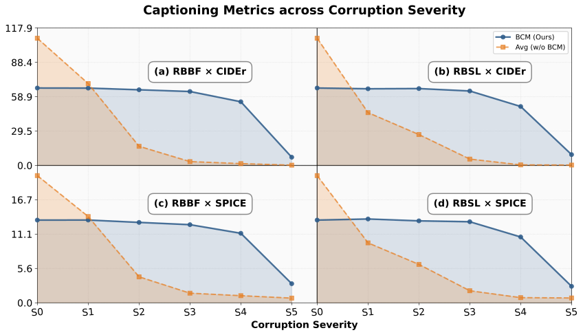
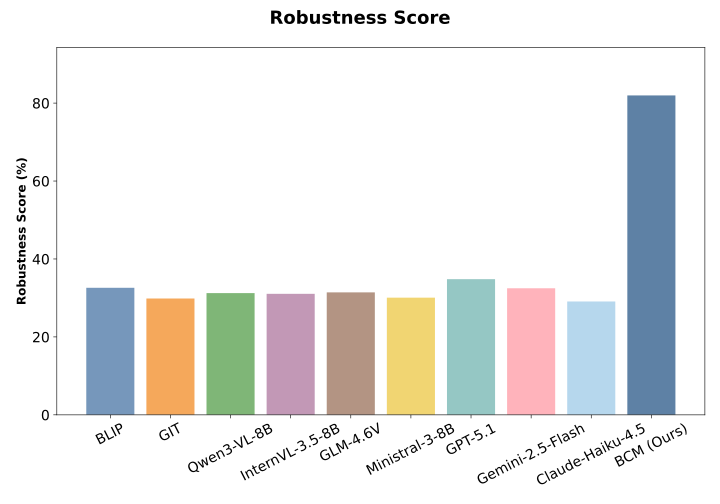
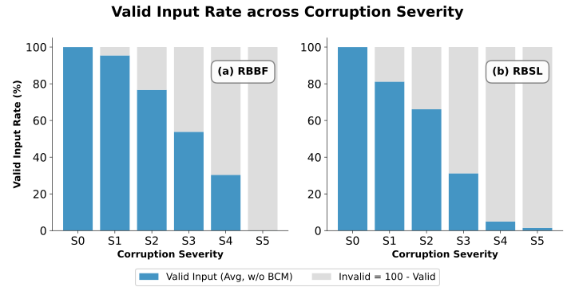

<table>
  <thead>
    <tr>
      <th rowspan="2">Model</th>
      <th colspan="6">RBBF</th>
    </tr>
    <tr>
      <th>S0</th>
      <th>S1</th>
      <th>S2</th>
      <th>S3</th>
      <th>S4</th>
      <th>S5</th>
    </tr>
  </thead>
  <tbody>
  <tr><th colspan="7">COCO Pretrained Models</th></tr>
  <tr><td>BLIP</td><td>102.9 / 18.8</td><td>67.6 / 13.4</td><td>19.4 / 4.8</td><td>5.0 / 2.3</td><td>3.0 / 1.9</td><td>0.2 / 0.8</td></tr>
  <tr><td>GIT</td><td>80.7 / 15.8</td><td>49.1 / 10.5</td><td>8.4 / 2.6</td><td>1.1 / 0.9</td><td>0.3 / 0.6</td><td>0.2 / 0.8</td></tr>
  <tr><th colspan="7">COCO Fine-Tuned Models</th></tr>
  <tr><td>Qwen3-VL-8B</td><td>133.8 / 23.3</td><td>81.9 / 15.8</td><td>21.6 / 5.5</td><td>4.5 / 1.9</td><td>2.0 / 1.3</td><td>0.3 / 0.8</td></tr>
  <tr><td>InternVL-3.5-8B</td><td>143.0 / <strong>24.5</strong></td><td>85.8 / 15.3</td><td>19.4 / 5.2</td><td>6.3 / 2.4</td><td>3.2 / 1.8</td><td>0.2 / 0.8</td></tr>
  <tr><td>GLM-4.6V</td><td><strong>146.9</strong> / 24.4</td><td><strong>96.1</strong> / 16.8</td><td>21.6 / 4.4</td><td>4.1 / 1.6</td><td>2.1 / 1.2</td><td>0.2 / 0.8</td></tr>
  <tr><td>Ministral-3-8B</td><td>115.0 / 20.3</td><td>72.7 / 13.4</td><td>12.9 / 3.3</td><td>4.3 / 1.6</td><td>1.9 / 1.0</td><td>0.2 / 0.8</td></tr>
  <tr><th colspan="7">Zero-Shot Generative Models</th></tr>
  <tr><td>GPT-5.1</td><td>80.0 / 19.7</td><td>58.5 / 14.7</td><td>19.6 / 5.4</td><td>2.4 / 1.3</td><td>0.9 / 0.9</td><td>0.2 / 0.8</td></tr>
  <tr><td>Gemini-2.5-Flash</td><td>122.5 / 23.5</td><td>85.7 / <strong>17.3</strong></td><td>21.6 / 5.0</td><td>1.7 / 1.2</td><td>0.6 / 0.9</td><td>0.2 / 0.8</td></tr>
  <tr><td>Claude-Haiku-4.5</td><td>57.3 / 14.7</td><td>34.6 / 8.3</td><td>3.4 / 1.4</td><td>0.3 / 0.8</td><td>0.2 / 0.8</td><td>0.2 / 0.8</td></tr>
  <tr><td>Avg (w/o BCM)</td><td>109.1 / 20.6</td><td>70.2 / 13.9</td><td>16.4 / 4.2</td><td>3.3 / 1.6</td><td>1.6 / 1.2</td><td>0.2 / 0.8</td></tr>
  <tr><td>BCM (Ours)</td><td>66.4 / 13.4</td><td>66.3 / 13.4</td><td><strong>64.9</strong> / <strong>13.0</strong></td><td><strong>63.4</strong> / <strong>12.6</strong></td><td><strong>54.6</strong> / <strong>11.2</strong></td><td><strong>7.0</strong> / <strong>3.1</strong></td></tr>
  </tbody>
</table>

<table>
  <thead>
    <tr>
      <th rowspan="2">Model</th>
      <th colspan="6">RBSL</th>
    </tr>
    <tr>
      <th>S0</th>
      <th>S1</th>
      <th>S2</th>
      <th>S3</th>
      <th>S4</th>
      <th>S5</th>
    </tr>
  </thead>
  <tbody>
  <tr><th colspan="7">COCO Pretrained Models</th></tr>
  <tr><td>BLIP</td><td>102.9 / 18.8</td><td>40.2 / 8.4</td><td>26.3 / 5.8</td><td>5.8 / 2.0</td><td>0.4 / 0.8</td><td>0.5 / 0.8</td></tr>
  <tr><td>GIT</td><td>80.7 / 15.8</td><td>30.3 / 6.6</td><td>16.3 / 4.0</td><td>2.8 / 1.2</td><td>0.3 / 0.8</td><td>0.3 / 0.7</td></tr>
  <tr><th colspan="7">COCO Fine-Tuned Models</th></tr>
  <tr><td>Qwen3-VL-8B</td><td>133.8 / 23.3</td><td>51.9 / 10.7</td><td>31.5 / 6.7</td><td>5.5 / 2.2</td><td>1.0 / 1.0</td><td>0.3 / 0.8</td></tr>
  <tr><td>InternVL-3.5-8B</td><td>143.0 / <strong>24.5</strong></td><td>54.2 / 11.1</td><td>35.2 / 8.3</td><td>5.6 / 2.1</td><td>0.6 / 0.9</td><td>0.3 / 0.8</td></tr>
  <tr><td>GLM-4.6V</td><td><strong>146.9</strong> / 24.4</td><td>63.6 / 11.5</td><td>38.1 / 7.7</td><td>7.0 / 2.1</td><td>0.5 / 0.8</td><td>0.5 / 0.8</td></tr>
  <tr><td>Ministral-3-8B</td><td>115.0 / 20.3</td><td>44.4 / 9.1</td><td>20.8 / 4.7</td><td>3.5 / 1.3</td><td>0.4 / 0.8</td><td>0.2 / 0.8</td></tr>
  <tr><th colspan="7">Zero-Shot Generative Models</th></tr>
  <tr><td>GPT-5.1</td><td>80.0 / 19.7</td><td>42.6 / 11.2</td><td>27.1 / 7.7</td><td>8.5 / 2.8</td><td>0.5 / 0.8</td><td>0.3 / 0.8</td></tr>
  <tr><td>Gemini-2.5-Flash</td><td>122.5 / 23.5</td><td>60.2 / 12.5</td><td>31.5 / 7.1</td><td>8.1 / 2.5</td><td>0.5 / 0.8</td><td>0.3 / 0.8</td></tr>
  <tr><td>Claude-Haiku-4.5</td><td>57.3 / 14.7</td><td>20.3 / 6.0</td><td>11.8 / 3.9</td><td>2.2 / 1.4</td><td>0.3 / 0.8</td><td>0.2 / 0.8</td></tr>
  <tr><td>Avg (w/o BCM)</td><td>109.1 / 20.6</td><td>45.3 / 9.7</td><td>26.5 / 6.2</td><td>5.4 / 2.0</td><td>0.5 / 0.8</td><td>0.3 / 0.8</td></tr>
  <tr><td>BCM (Ours)</td><td>66.4 / 13.4</td><td><strong>65.8</strong> / <strong>13.5</strong></td><td><strong>65.9</strong> / <strong>13.2</strong></td><td><strong>63.9</strong> / <strong>13.1</strong></td><td><strong>50.6</strong> / <strong>10.6</strong></td><td><strong>9.3</strong> / <strong>2.7</strong></td></tr>
  </tbody>
</table>

<table>
  <thead>
    <tr>
      <th rowspan="2">Model</th>
      <th colspan="6">RBBF (Valid Input Rate %)</th>
    </tr>
    <tr>
      <th>S0</th>
      <th>S1</th>
      <th>S2</th>
      <th>S3</th>
      <th>S4</th>
      <th>S5</th>
    </tr>
  </thead>
  <tbody>
  <tr><th colspan="7">COCO Pretrained Models</th></tr>
  <tr><td>BLIP</td><td>100.0%</td><td>98.4%</td><td>87.4%</td><td>70.0%</td><td>44.6%</td><td>0.0%</td></tr>
  <tr><td>GIT</td><td>99.8%</td><td>97.6%</td><td>85.8%</td><td>68.4%</td><td>44.4%</td><td>0.0%</td></tr>
  <tr><th colspan="7">COCO Fine-Tuned Models</th></tr>
  <tr><td>Qwen3-VL-8B</td><td>100.0%</td><td>99.6%</td><td>97.8%</td><td>72.0%</td><td>43.4%</td><td>0.4%</td></tr>
  <tr><td>InternVL-3.5-8B</td><td>100.0%</td><td>97.0%</td><td>87.8%</td><td>70.2%</td><td>39.8%</td><td>0.2%</td></tr>
  <tr><td>GLM-4.6V</td><td>100.0%</td><td>98.2%</td><td>88.6%</td><td>74.2%</td><td>41.2%</td><td>0.4%</td></tr>
  <tr><td>Ministral-3-8B</td><td>100.0%</td><td>97.8%</td><td>88.0%</td><td>72.8%</td><td>40.8%</td><td>0.0%</td></tr>
  <tr><th colspan="7">Zero-Shot Generative Models</th></tr>
  <tr><td>GPT-5.1</td><td>100.0%</td><td>91.2%</td><td>56.4%</td><td>20.4%</td><td>5.4%</td><td>0.0%</td></tr>
  <tr><td>Gemini-2.5-Flash</td><td>100.0%</td><td>94.0%</td><td>70.8%</td><td>33.6%</td><td>13.8%</td><td>0.0%</td></tr>
  <tr><td>Claude-Haiku-4.5</td><td>100.0%</td><td>85.2%</td><td>27.4%</td><td>2.8%</td><td>0.0%</td><td>0.0%</td></tr>
  <tr><td>Avg (w/o BCM)</td><td>100.0%</td><td>95.4%</td><td>76.7%</td><td>53.8%</td><td>30.4%</td><td>0.1%</td></tr>
  <tr><td>BCM (Ours)</td><td>100.0%</td><td>100.0%</td><td>100.0%</td><td>100.0%</td><td>100.0%</td><td>100.0%</td></tr>
  </tbody>
</table>

<table>
  <thead>
    <tr>
      <th rowspan="2">Model</th>
      <th colspan="6">RBSL (Valid Input Rate %)</th>
    </tr>
    <tr>
      <th>S0</th>
      <th>S1</th>
      <th>S2</th>
      <th>S3</th>
      <th>S4</th>
      <th>S5</th>
    </tr>
  </thead>
  <tbody>
  <tr><th colspan="7">COCO Pretrained Models</th></tr>
  <tr><td>BLIP</td><td>100.0%</td><td>80.4%</td><td>66.4%</td><td>31.2%</td><td>3.2%</td><td>1.8%</td></tr>
  <tr><td>GIT</td><td>99.8%</td><td>80.0%</td><td>66.2%</td><td>30.2%</td><td>3.2%</td><td>1.8%</td></tr>
  <tr><th colspan="7">COCO Fine-Tuned Models</th></tr>
  <tr><td>Qwen3-VL-8B</td><td>100.0%</td><td>87.6%</td><td>69.2%</td><td>35.8%</td><td>5.4%</td><td>1.0%</td></tr>
  <tr><td>InternVL-3.5-8B</td><td>100.0%</td><td>85.0%</td><td>71.4%</td><td>29.6%</td><td>3.8%</td><td>1.6%</td></tr>
  <tr><td>GLM-4.6V</td><td>100.0%</td><td>85.0%</td><td>69.2%</td><td>30.0%</td><td>5.2%</td><td>2.0%</td></tr>
  <tr><td>Ministral-3-8B</td><td>100.0%</td><td>83.6%</td><td>63.8%</td><td>32.0%</td><td>5.6%</td><td>1.0%</td></tr>
  <tr><th colspan="7">Zero-Shot Generative Models</th></tr>
  <tr><td>GPT-5.1</td><td>100.0%</td><td>73.8%</td><td>62.0%</td><td>30.8%</td><td>6.0%</td><td>1.4%</td></tr>
  <tr><td>Gemini-2.5-Flash</td><td>100.0%</td><td>82.6%</td><td>65.8%</td><td>31.6%</td><td>6.0%</td><td>1.4%</td></tr>
  <tr><td>Claude-Haiku-4.5</td><td>100.0%</td><td>72.4%</td><td>61.0%</td><td>29.6%</td><td>6.0%</td><td>1.4%</td></tr>
  <tr><td>Avg (w/o BCM)</td><td>100.0%</td><td>81.2%</td><td>66.1%</td><td>31.2%</td><td>4.9%</td><td>1.5%</td></tr>
  <tr><td>BCM (Ours)</td><td>100.0%</td><td>100.0%</td><td>100.0%</td><td>100.0%</td><td>100.0%</td><td>100.0%</td></tr>
  </tbody>
</table>
## Visualizations
### Combined Curves (CIDEr/SPICE)

### Combined Drop Heatmaps (relative to S0)

### Aggregate robustness score

Summary CSV: [robustness_summary.csv](robustness_summary.csv)

## Valid Input Rate across Corruption Levels

